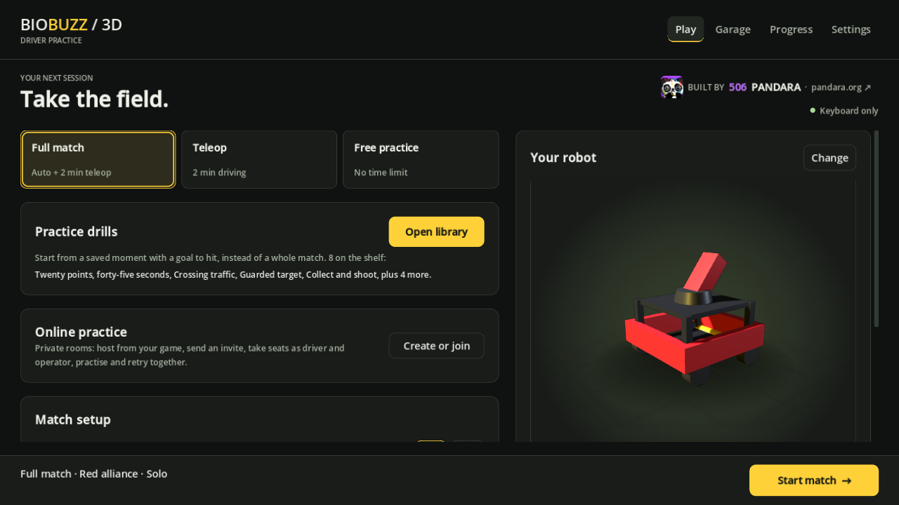
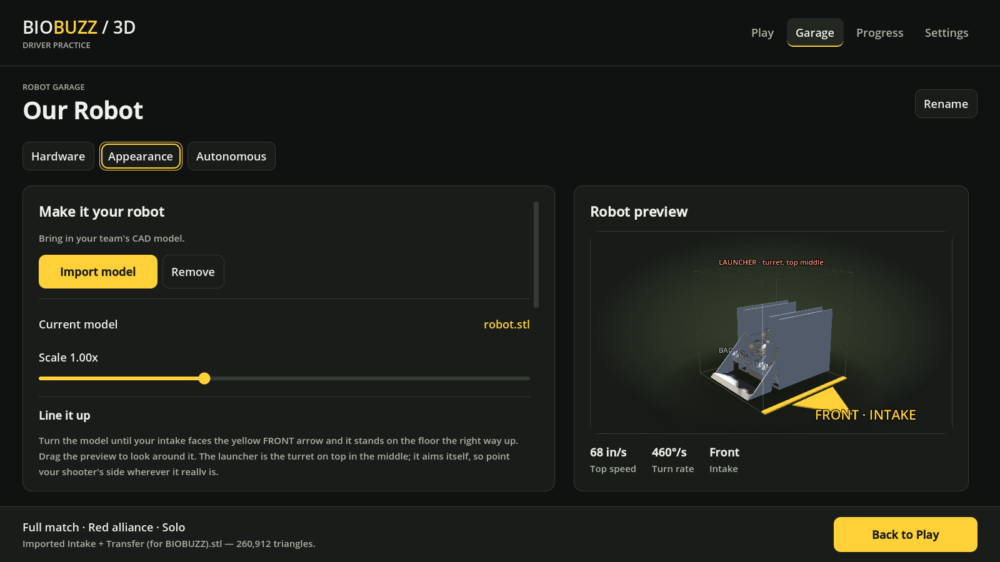
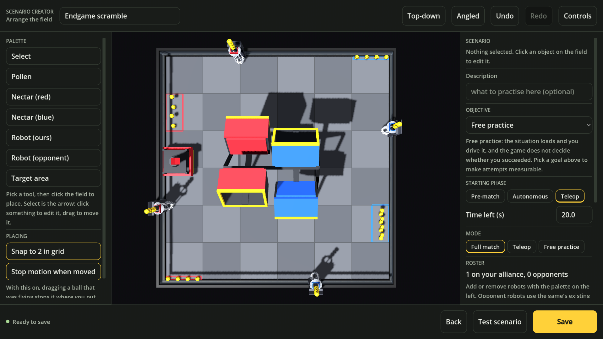

# BIOBUZZ 3D

**A 3D driver-practice simulator for the FTC 2026–27 game BIOBUZZ**, built in
Godot 4.5 by [FTC Team 506 Pandara](https://pandara.org).

Real rigid-body physics (Jolt, 180 Hz) instead of a 2D approximation: the HIVES
tip from the weight of what is in them, balls roll, robots push. Field, scoring
and enforceable rules come from the Competition Manual V1.



## Play it

| | What you get | Where |
|---|---|---|
| **In the browser** | Offline practice, drills, scenario editor, replays. Any computer with a modern browser (Chrome, Edge, Firefox, Safari), incl. Chromebooks. Nothing to install. | https://pandara.org |
| **Windows download** | Everything above **plus** online rooms (over the internet or same network) and importing your team's CAD. | Download this repo |

Windows download: unzip the whole folder and run `BioBuzz3D.exe` (keep the
`.dll` files next to it). The first time, Windows SmartScreen says "Windows
protected your PC" because the game is not code-signed — click **More info →
Run anyway**.

## Features

- **Full match / Teleop / Free practice**, keyboard or controllers, 1–2 drivers
  per alliance, driver + operator split, configurable AI opponents
- **Practice drills**: save any moment as a situation with a goal and drive it again
- **Scenario editor**: place elements, robots and target areas; test instantly
- **Replays** of every run, with a timeline and "practise from here"
- **Online practice rooms**: one player hosts from inside the game, friends join
  with an invite — no server to rent (Epic Online Services, peer-to-peer with
  relay fallback)
- **Graphics presets Low → Max**: Max renders at twice the resolution and
  shrinks it down for the sharpest edges; motion is interpolated between
  physics steps so it stays smooth at any frame rate
- **Your team's CAD as the robot**: import GLB/glTF/STL, line it up with
  FRONT/INTAKE guides; driving and collisions stay the legal 18 in cube

| | |
|---|---|
|  |  |

## Develop

Quick start (full guide: [`docs/DEVELOPING.md`](docs/DEVELOPING.md)):

1. Install **Godot 4.5** (standard build, not .NET) and its export templates.
2. Clone, then open `project.godot` in Godot.
3. Install the Epic plugin binaries once:
   [`addons/epic-online-services-godot/bin/README.md`](addons/epic-online-services-godot/bin/README.md).
4. For internet rooms, copy `eos_credentials.example.cfg` to
   `eos_credentials.cfg` and fill in the team's Epic IDs (**never commit it**).
5. **F5** to run. `tools/run_tests.sh` runs the test suite.

Builds: Windows from the editor (**Project → Export → Windows Desktop**),
browser with `tools/build/export_web.sh`. Releasing: [`docs/RELEASING.md`](docs/RELEASING.md).

## Repository map

```
project.godot, export_presets.cfg   Godot project and export settings
scenes/        main + boot scenes (everything else is built from code)
scripts/       the game — bb.gd holds every manual constant
scripts/net/   online rooms (player-hosted, EOS / LAN)
assets/        team panda, symbol font
addons/        Epic Online Services plugin (scripts; binaries per machine)
tools/         test harnesses (debug_*.tscn), build + test scripts
docs/          design notes, online setup, dev log, release notes
.github/       workflow that publishes the browser version to GitHub Pages
```

## More documentation

- [`docs/GAME_GUIDE.md`](docs/GAME_GUIDE.md) — modes, controls, settings, how the physics works
- [`docs/ONLINE.md`](docs/ONLINE.md) — online rooms and the one-time Epic setup
- [`docs/REPLAYS.md`](docs/REPLAYS.md), [`docs/CONTROLLERS.md`](docs/CONTROLLERS.md), [`docs/OPPONENTS.md`](docs/OPPONENTS.md)
- [`docs/DEVLOG.md`](docs/DEVLOG.md) — the full build log (STATUS block at the bottom = where things stand)
- [`THIRD_PARTY.md`](THIRD_PARTY.md) — licences of included components

---

Unofficial practice tool by FTC Team 506 Pandara · [pandara.org](https://pandara.org).
Not affiliated with or endorsed by *FIRST*.
